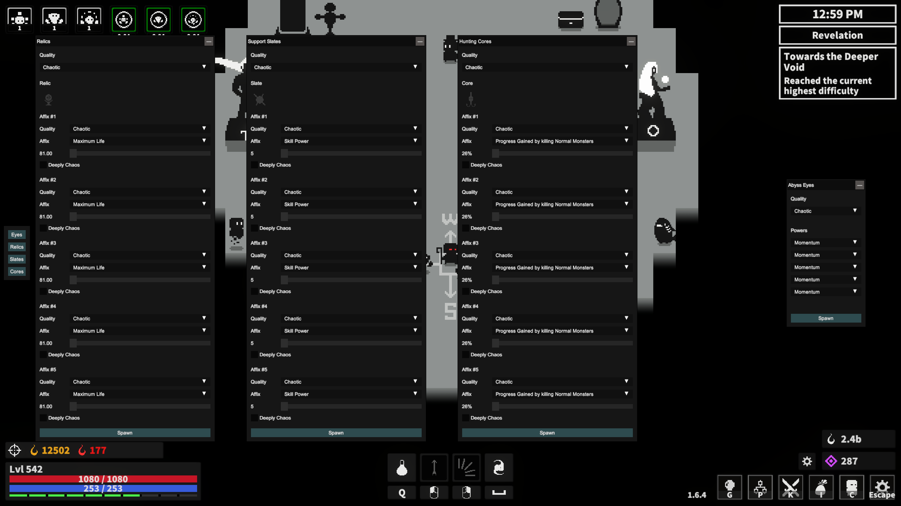
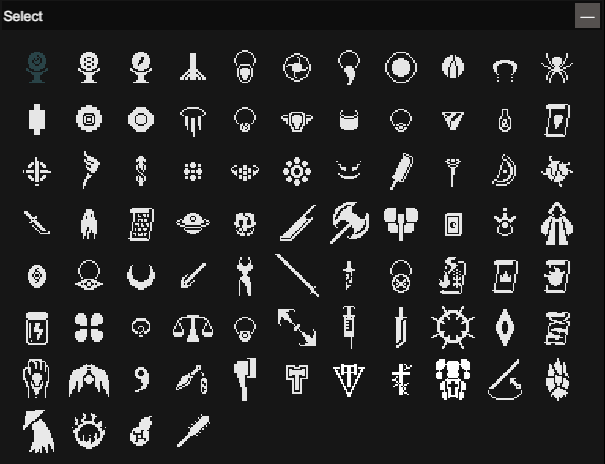
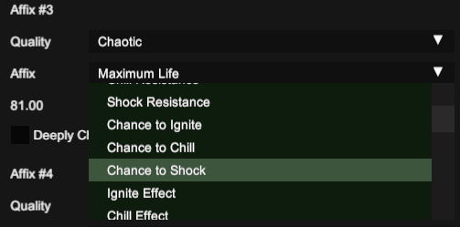

<h1 align="center">
DHG Item Spawner
</h1>

> Dark Hunting Ground BepInEx Plugin for spawning in items.

---

 

## [Overview](#overview)

While testing out builds in the end-game
of [Dark Hunting Ground](data:text/html,%3Cbody%3E%3C%2Fbody%3E%3C!--tracking:f9nr5g:/library/app/2494810--%3E), I've
consistently had to waste time and resources respecting items. Since my primarily intention is in just quickly testing
different build archetypes, wasting time running between NPCs (and burning resources) just to get a slightly different
build, has become a pain in my ass. To help circumvent this, I decided to write a plugin that just spawns in items.

This plugin adds various GUI panels for spawning in all the items in the game, which selectable dropdowns and sliders
for testing out specific builds.

## [Demo](#demo)

*Individual panels per item type, which can be open and closed via a navbar*

*Select items via a grid of their icons*

*Select powers and affixes, regardless if they're drop exclusive or not*

## [Installation](#installation)

Make sure you have [BepInEx](https://docs.bepinex.dev/articles/user_guide/installation/index.html) installed, and have
run the game at least once.

Download the [latest released version](https://github.com/daymxn/dhg.ItemSpawner/releases) of the mod on GitHub.

Extract the `daymxn.DHG.ItemSpawner` folder to the `BepInEx/plugins` directory in your game files. If you
don't have a `plugins` directory, you can go ahead and create one.

> [!NOTE]
> The navbar will show after a few seconds at the main menu, but the buttons will be disabled until you load a save.

## [Future Work](#future-work)

There's definitely a few places where I feel like this could be improved upon, or features could be added. A few of such
cases are:

- Migrate to MVVM.
- Possibly migrate to different UI framework.
    * UniverseLib was great for prototyping, but I've found myself fighting with it more than working on features.
      I'm not sure what the best alternative would be (maybe even writing my own UI library), but it's worth
      investigating in the future.
- Add support for selecting and modifying existing items in the player's inventory.
- Auto complete dropdown for affixes and powers.
- Some form of affix dropdown that mirrors the game's dropdown for chaos behavior (where it shows the description and
  values).
- Save and load from share code.
- Recently spawned in items for quick selection to make minor changes or spawn again.
- Better infrastructure for handling potential missing translation in future content.
- Some form of auto-update or update checking.
- Keybinds for opening and closing windows alongside the navbar.
- Configuration options (such as theme, keybinds, sound volume, whether to show on default, whether to show navbar,
  etc.)
- Quick outfit swapper for quickly testing out different builds.
- Ensure only one stat can have deep chaos enabled at once.

## [Contributing](#contributing)

If you're interested in contributing, give the [CONTRIBUTING](CONTRIBUTING.md) doc a read.

## [License](#license)

[Apache 2.0](./LICENSE)
